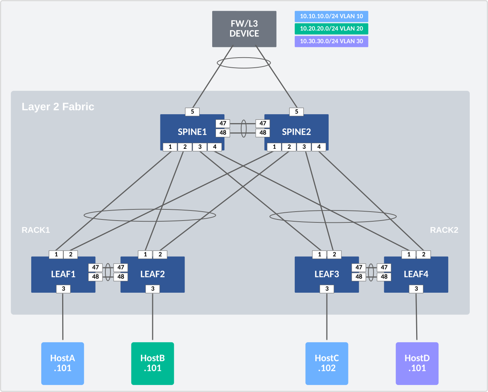
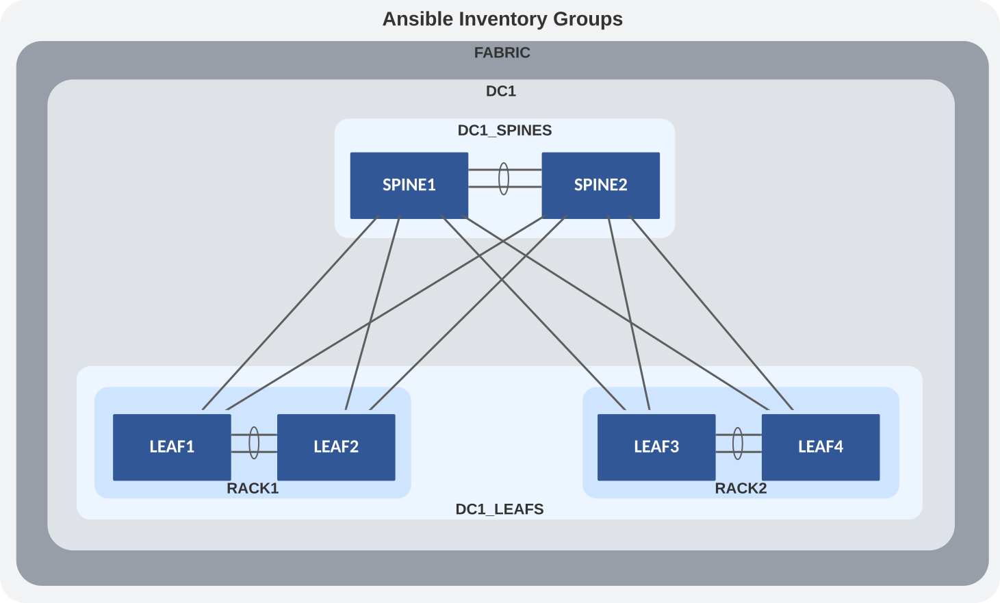

---
# This title is used for search results
title: L2LS Fabric
---

# L2LS Fabric

## Introduction

This example includes and describes all the AVD files used to build a Layer 2 Leaf Spine (L2LS) fabric with the following nodes:

- Two spine nodes
- Four leaf nodes

The network fabric in this example is layer 2; an external firewall (FW) or layer 3 (L3) device will handle routing. Later, in this example, we will discuss adding L3 routing to the spines. But first, we will focus on defining the fabric variables to build this L2LS Topology. Before we start, we must ensure we have installed AVD with the requirements covered in the Installation & Requirements section.

The example is meant as a starting foundation. You may build more advanced fabrics based on this design. To keep things simple, the Arista eAPI will be used to communicate with the switches.


## Design Overview

### Physical L2LS Topology

The drawing below shows the physical topology used in this example. The interface assignment shown here are referenced across the entire example, so keep that in mind if this example must be adapted to a different topology.




In this example, the FW/L3 Device and individual hosts (A-D) are not managed by AVD, but the switch ports connecting to these devices are.

## Ansible Inventory

Now that we understand the physical L2LS topology, we must create the Ansible inventory that represents this topology. The following is a textual and graphical representation of the Ansible inventory group variables and naming scheme used in this example:

``` text
- FABRIC
  - DC1
    - DC1_SPINES
    - DC1_LEAFS
  - DC1_NETWORK_SERVICES
    - DC1_SPINES
    - DC1_LEAFS
  - DC1_ENDPOINTS
    - DC1_SPINES
    - DC1_LEAFS
```

FABRIC represents the highest level within the hierarchy. Ansible variables defined at this level will be applied to all nodes in the fabric. Ansible groups have parent-and-child relationships. For example, both DC1_SPINES and DC1_LEAFS are children of DC1. Groups of Groups are possible and allow variables to be shared at any level within the hierarchy. For example, DC1_NETWORK_SERVICES is a group with two other groups defined as children: DC1_SPINES and DC1_LEAFS. The same applies to the group named DC1_ENDPOINTS. You will see these groups listed at the bottom of the inventory file.

This naming convention makes it possible to extend anything quickly but can be changed based on your preferences. The names of all groups and hosts must be unique.




## AVD Fabric Variables

To apply AVD variables to the nodes in the fabric, we make use of Ansible group_vars. How and where you define the variables is your choice. The group_vars table below is one example of AVD fabric variables.

| group_vars/              | Description                                   |
| ------------------------ | --------------------------------------------- |
| FABRIC.yml               | Global settings for all devices               |
| DC1.yml                  | Site specific settings                        |
| DC1_SPINES.yml           | Device type and common settings for spines    |
| DC1_LEAFS.yml            | Device type  and common settings for leafs    |
| DC1_NETWORK_SERVICES.yml | VLANs                                         |
| DC1_ENDPOINTS.yml        | Port Profiles and Connected Endpoint settings |


## The Playbooks

Now that we have defined all of our input variables according to AVD Design data models, it is time to generate some configs. To make things simple, we provide two playbooks. One playbook will allow you to build and view EOS CLI intended configurations per device. The second playbook has an additional task to deploy the configurations to your switches. The playbooks are provided in the tabs below. The playbook is straightforward as it imports two AVD roles: eos_designs and eos_cli_config_gen, which do all the heavy lifting. Combining these two roles produces recommended configurations that follow Arista Design Guides.


    ansible_collections/arista/avd/examples/l2ls-fabric/build.yml


    ansible_collections/arista/avd/examples/l2ls-fabric/deploy.yml


### Playbook Run

To build the configuration files, run the playbook called `build.yml`.

``` bash
### Build configurations
ansible-playbook playbooks/build.yml
```

After the playbook run finishes, EOS CLI intended configuration files were written to `intended/configs`.

To build and deploy the configurations to your switches, run the playbook called `deploy.yml`. This assumes that your Ansible host has access and authentication rights to the switches. Those auth variables were defined in DC1.yml.

``` bash
### Build configurations & Push Configs to switches
ansible-playbook playbooks/deploy.yml
```


Try building your topology.
